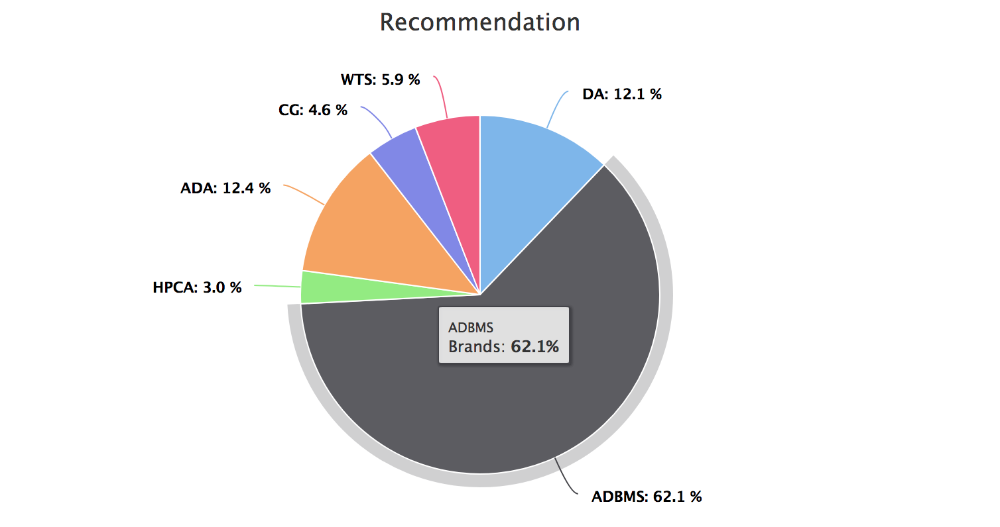

# ElectivesRec
A Web application that recommends electives to take in the curriculum based on past academic data.

## Installing flask
```pip install Flask```

## Installing MongoDB
https://www.digitalocean.com/community/tutorials/how-to-install-and-secure-mongodb-on-ubuntu-16-04

Host mongodb in mLab.(Move the local collections to the database in mLab)

## Installing pymongo
```pip install pymongo```

## Prediction & Visualization

We are using a Logistic regression classifier to get probabilities for each elective and then render a pie chart using HighCharts.




  
